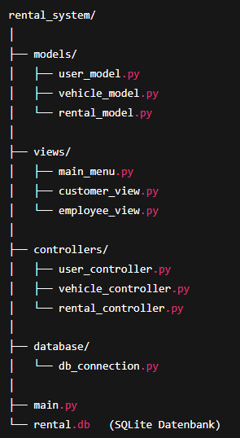

# MVC im Vehicle Rental System

## Ziel
Das hilft, die Programmlogik klar zu strukturieren und Verantwortlichkeiten zu trennen.

---

## 1. Model
- **Was?**  
  Enthält die **Datenbank-Logik**: Klassen und Funktionen für `User`, `Customer`, `Vehicle`, `Rental`, `Payment`.  
- **Beispiele:**  
  - `VehicleModel.get_available_vehicles()`  
  - `RentalModel.create_rental(customer_id, vehicle_id, start, end)`  
  - `PaymentModel.add_payment(rental_id, amount)`  

Das Model spricht direkt mit **SQLite** (`sqlite3`), aber nichts von der Benutzeroberfläche.

---

## 2. View
- **Was?**  
  Präsentiert die Daten für den Benutzer → hier ist es eine **Konsole** (kein GUI).  
- **Beispiele:**  
  - Menü ausgeben (Kunden- oder Mitarbeiter-Menü)  
  - Tabellen oder Listen von Fahrzeugen anzeigen  
  - Eingaben vom Benutzer entgegennehmen  

Die View zeigt nur an, **was** passiert, aber kennt keine Geschäftslogik.

---

## 3. Controller
- **Was?**  
  Vermittler zwischen **Model** und **View**.  
  Nimmt Benutzeraktionen entgegen, ruft Methoden im Model auf, und entscheidet, welche View angezeigt wird.  
- **Beispiele:**  
  - `RentalController.rent_vehicle()` → prüft Verfügbarkeit, ruft Model auf, gibt Ergebnis an View weiter.  
  - `UserController.login()` → prüft Zugangsdaten, ruft Model auf, gibt Menü in View zurück.  
  - `VehicleController.show_available()` → fragt Model nach Daten, zeigt diese über View an.  

---

## Übungsaufgabe 1 – Diagramm zeichnen
Zeichne ein **MVC-Diagramm**:  
- Links „View“ (z. B. `MainMenu`, `RentalMenu`)  
- Mitte „Controller“ (z. B. `RentalController`, `UserController`)  
- Rechts „Model“ (z. B. `RentalModel`, `VehicleModel`)  
- Pfeile: View → Controller → Model → zurück  

---

## Übungsaufgabe 2 – Pseudocode
Schreibe Pseudocode für die MVC-Aufteilung der Funktion **„Fahrzeug mieten“**:  

- **View**: fragt Benutzer nach FahrzeugID und Zeitraum  
- **Controller**: prüft Eingaben, ruft Model auf  
- **Model**: überprüft Datenbank, erstellt neuen Mietvertrag  
- **View**: zeigt Erfolg oder Fehlermeldung  

Beispiel:

```
VIEW: frage Kunde nach FahrzeugID und Zeitraum
CONTROLLER: empfange Eingaben
CONTROLLER: prüfe ob Fahrzeug verfügbar
    wenn nein → View zeigt Fehlermeldung
CONTROLLER: rufe Model.create_rental(...) auf
MODEL: lege neuen Datensatz in Rental an, setze Fahrzeugstatus auf "Rented"
CONTROLLER: gebe Rückmeldung an View
VIEW: zeigt Bestätigung "Fahrzeug erfolgreich gemietet"
```

---

## Beispiel Verzeichnisstruktur fuer unser Projekt



---

## Beispiel Model

```python
import sqlite3

DB_FILE = "rental.db"

class VehicleModel:
    @staticmethod
    def get_available_vehicles():
        conn = sqlite3.connect(DB_FILE)
        cur = conn.cursor()
        cur.execute("SELECT VehicleID, Brand, Model, Year, DailyRate FROM Vehicle WHERE Status = 'Available'")
        vehicles = cur.fetchall()
        conn.close()
        return vehicles

    @staticmethod
    def update_vehicle_status(vehicle_id, status):
        conn = sqlite3.connect(DB_FILE)
        cur = conn.cursor()
        cur.execute("UPDATE Vehicle SET Status = ? WHERE VehicleID = ?", (status, vehicle_id))
        conn.commit()
        conn.close()
```

## Beispiel View
```python
class MainMenuView:
    @staticmethod
    def show_customer_menu():
        print("\n===== Kunden Menü =====")
        print("1. Verfügbare Fahrzeuge anzeigen")
        print("2. Fahrzeug mieten")
        print("3. Fahrzeug zurückgeben")
        print("4. Eigene Miet-Historie anzeigen")
        print("5. Logout")

    @staticmethod
    def show_vehicles(vehicles):
        if not vehicles:
            print("Keine Fahrzeuge verfügbar.")
        else:
            for v in vehicles:
                print(f"ID: {v[0]} | {v[1]} {v[2]} ({v[3]}) - {v[4]} €/Tag")

```


## Beispiel Controller

```python
from models.vehicle_model import VehicleModel
from views.main_menu import MainMenuView

class VehicleController:
    @staticmethod
    def show_available_vehicles():
        vehicles = VehicleModel.get_available_vehicles()
        MainMenuView.show_vehicles(vehicles)

```

## Main Datei

```python
from controllers.vehicle_controller import VehicleController
from views.main_menu import MainMenuView

def main():
    while True:
        MainMenuView.show_customer_menu()
        choice = input("Wähle eine Option: ")

        if choice == "1":
            VehicleController.show_available_vehicles()
        elif choice == "5":
            print("Logout erfolgreich. Programm beendet.")
            break
        else:
            print("Ungültige Eingabe.")

if __name__ == "__main__":
    main()

```

---

* Model kennt nur die Datenbank.

* View zeigt nur an und nimmt Eingaben entgegen.

* Controller steuert den Ablauf und ruft Model und View auf.

Durch die Verzeichnisstruktur ist der Code sauber getrennt und leicht erweiterbar.

---