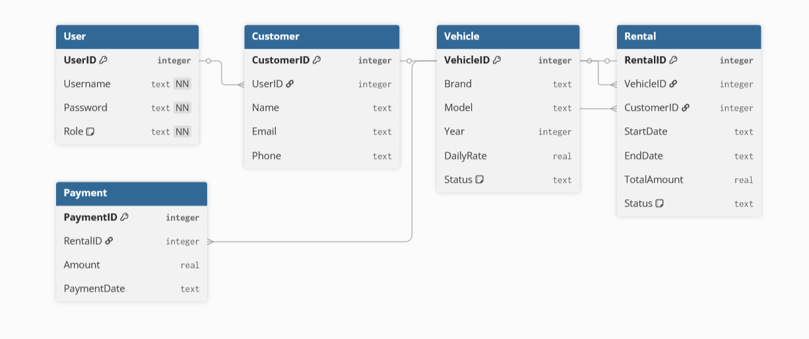

# Python-Übungsprojekt: Fahrzeugvermietung mit SQLite (Konsolenanwendung)

## Ziel
Wir bauen ein **Fahrzeugvermietungs-System** in **Python**, das mit **SQLite** arbeitet.  
Wir üben dabei:
- **Datenbank-Interaktionen** mit SQLite  
- **Benutzerauthentifizierung** (Login als Kunde oder Mitarbeiter)  
- **Fahrzeugverwaltung** (hinzufügen, aktualisieren, ausleihen, zurückgeben)  
- **Transaktionen und Geschäftsregeln** (z. B. Fahrzeug darf nicht doppelt gemietet werden)  
- **Fehlerbehandlung und Logging**  

---

## 0. Plannungsphase
- Diagramme, Pseudocode und Struktogramme erstellen.

---

## 1. Projektvorbereitung
- Erstelle ein neues Verzeichnis `rental_system`.  
- Erstelle eine Python-Datei `main.py`.  
- Erstelle eine SQLite-Datenbank `rental.db`.  

---

## 2. Datenbankschema
Definiere Tabellen in `rental.db`:

```sql
CREATE TABLE User (
    UserID INTEGER PRIMARY KEY,
    Username TEXT UNIQUE NOT NULL,
    Password TEXT NOT NULL,
    Role TEXT NOT NULL -- "Employee" oder "Customer"
);

CREATE TABLE Customer (
    CustomerID INTEGER PRIMARY KEY,
    UserID INTEGER,
    Name TEXT,
    Email TEXT,
    Phone TEXT,
    FOREIGN KEY(UserID) REFERENCES User(UserID)
);

CREATE TABLE Vehicle (
    VehicleID INTEGER PRIMARY KEY,
    Brand TEXT,
    Model TEXT,
    Year INTEGER,
    DailyRate REAL,
    Status TEXT -- "Available", "Rented", "Maintenance"
);

CREATE TABLE Rental (
    RentalID INTEGER PRIMARY KEY,
    VehicleID INTEGER,
    CustomerID INTEGER,
    StartDate TEXT,
    EndDate TEXT,
    TotalAmount REAL,
    Status TEXT, -- "Active", "Completed"
    FOREIGN KEY(VehicleID) REFERENCES Vehicle(VehicleID),
    FOREIGN KEY(CustomerID) REFERENCES Customer(CustomerID)
);

CREATE TABLE Payment (
    PaymentID INTEGER PRIMARY KEY,
    RentalID INTEGER,
    Amount REAL,
    PaymentDate TEXT,
    FOREIGN KEY(RentalID) REFERENCES Rental(RentalID)
);
```

## DB-Schema



---

# Planungsaufgaben für das Projekt

Bevor du mit dem Programmieren beginnst, überlege dir, wie das System aufgebaut sein soll.  
Bearbeite die folgenden Aufgaben:


## Aufgabe A – Pseudocode und Struktogramme
Schreibe Pseudocode und Struktogramme für mehrere Funktionen.  
Dein Pseudocode soll die einzelnen Schritte des Prozesses enthalten.
Deine Struktogramme sollen euer Pseudocode Darstellen.

---

## Aufgabe B – Aktivitätsdiagramm
Erstelle **Aktivitätsdiagramme** für mehrere Prozesse.
Bspw: **„Fahrzeug zurückgeben“**.  
Es soll u. a. folgende Schritte zeigen:
- Kunde bringt Auto zurück  
- Kilometerstand eingeben  
- Rechnungsbetrag berechnen  
- Zahlung erfassen  
- Fahrzeugstatus auf „Available“ setzen  

---

## Aufgabe C – Klassendiagramm
Entwirf ein **Klassendiagramm** für das System.  
Folgende Klassen könnten vorkommen:  
- `User`  
- `Customer`  
- `Vehicle`  
- `Rental`  
- `Payment`  

Überlege dir Attribute (z. B. `name`, `email`, `daily_rate`) und Methoden (z. B. `rent_vehicle()`, `return_vehicle()`).  


---

## 3. Login-Feature (Konsole)
- Benutzer meldet sich mit **Username** und **Password** an.  
- Mitarbeiter sehen Admin-Funktionen.  
- Kunden können nur Fahrzeuge suchen, mieten und ihre Historie einsehen.  

---

## 4. Menüsystem (Konsole)

### Mitarbeiter-Menü
```
===== Mitarbeiter Menü =====
1. Alle Fahrzeuge anzeigen
2. Neues Fahrzeug hinzufügen
3. Fahrzeugstatus ändern (Available/Rented/Maintenance)
4. Alle aktiven Vermietungen anzeigen
5. Logout
============================
```

### Kunden-Menü
```
===== Kunden Menü =====
1. Verfügbare Fahrzeuge anzeigen
2. Fahrzeug mieten
3. Fahrzeug zurückgeben
4. Eigene Miet-Historie anzeigen
5. Logout
========================
```

---

## 5. Geschäftsregeln
- Ein Fahrzeug darf nur gemietet werden, wenn es **Available** ist.  
- Ein Kunde darf maximal **ein aktives Mietobjekt gleichzeitig** haben.  
- Beim Zurückgeben: Status des Fahrzeugs → `Available`, Mietvorgang → `Completed`.  
- Bei Fehlern: Log-Eintrag in `rental_error.log`.  

---

## 6. Fehlerbehandlung
- Alle Datenbankoperationen mit `try/except`.  
- Fehler ins Log schreiben (`rental_error.log`).  

Beispiel:
```python
# Log Datei festlegen beispiel:
log_datei = f"rental_error_{datetime.now().strftime("%Y-%m-%d_%H-%M-%S")}.log"
try:
    # Falsches SQL (spalte "Brandd" existiert nicht.)
    cur.execute("SELECT Brandd FROM Vehicle")

except Exception as e:
    # timestamp erstellen
    timestamp = datetime.now().strftime("%Y-%m-%d %H:%M:%S")

    # Zu log Datei Speichern
    with open(log_datei, "a", encoding="utf-8") as f:
        f.write(f"[{timestamp}] SQL Error: {e}\n")
```

---

## 7. Erweiterungsideen
- Suchfunktion nach Marke/Modell/Jahr.  
- Zahlungsmodul: bei Rückgabe Gesamtpreis = Miettage × Tagespreis.  
- Mitarbeiter können Berichte erstellen (z. B. Einnahmen pro Monat).  
- Passwort ändern.  
- Zahlungs api einbauen damit man tatsaechlich Zahlen kann.
- Uberlegen wie erstelle ich eine GUI (tkinter)

---

## 8. Dokumentation Erstellen
- Schreibt fuer jede Klasse und jede Methode einen Docstring im Google Style.

---

## 9. Präsentation Erstellen
- Jeder wird zeigen: Login, Fahrzeuge ansehen, Fahrzeug mieten, zurückgeben. 
- Optionale Erweiterungen vorstellen (z. B. Filter, Berichte), wenn MVC verwendet worden ist: - Reflexion: **Was hat MVC gebracht?** 